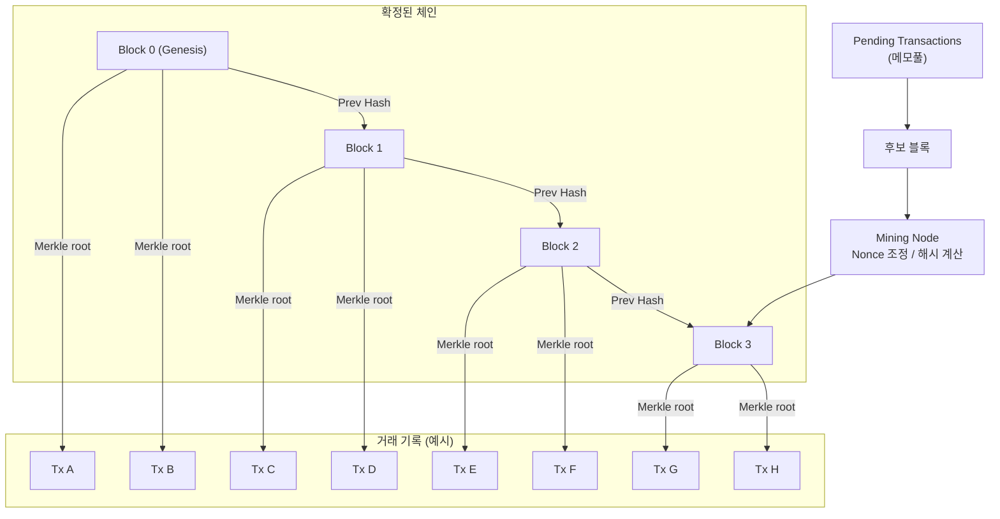

# MiniCoin 블록체인 학습 정리

## 1. 모든 노드가 전체 블록을 갖고 있나요?
- 퍼블릭 블록체인의 **풀노드**는 생성된 모든 블록과 트랜잭션을 저장·검증하며 서로 동기화합니다.
- 자원 절약을 위해 일부만 저장하거나 헤더만 유지하는 **라이트노드/프루노드**도 존재합니다. 이들은 풀노드에 의존해 필요한 데이터를 확인합니다.
- MiniCoin 예제는 인메모리 체인을 가진 단일 인스턴스로, 추후 노드 간 동기화를 구현하면 각 인스턴스가 동일한 체인 전체를 공유하도록 확장할 수 있습니다.

## 2. 블록 개수(Block Count)의 의미
- 블록 개수는 블록체인의 **길이** 또는 **블록 높이(height)**를 나타냅니다.
- 제네시스 블록(높이 0) 이후 블록이 추가될 때마다 높이가 1씩 증가합니다.
- 이 숫자는 네트워크가 얼마나 많은 거래 기록을 쌓았는지, 체인이 얼마나 오래 유지되어왔는지의 지표가 됩니다.

## 3. 블록이 늘어나는 기준
- 새 트랜잭션이 모여 후보 블록이 만들어집니다.
- Proof-of-Work 같은 합의 절차를 통과해야 하며, 보통 계산이 까다로운 해시 문제를 해결해야 합니다.
- 유효한 블록을 찾으면 네트워크에 전파되고, 다수가 승인하면 체인 끝에 연결되어 블록 수가 1 증가합니다.
- MiniCoin 현재 버전은 샘플 블록만 제공하지만, PoW와 동기화를 구현하면 이 과정을 실습할 수 있습니다.

## 4. 정해진 난이도를 만족하는 해시란?
- Proof-of-Work에서는 블록 헤더 해시가 네트워크가 정한 **난이도 조건**을 만족해야 합니다.
- 비트코인에서는 “해시 값이 특정 타겟 값보다 작을 것”이라는 규칙이며, 쉽게 표현하면 해시 앞자리 0이 일정 개수 이상 나와야 합니다.
- 이를 위해 채굴자는 `nonce` 값을 바꿔가며 해시를 반복 계산하고, 조건을 충족하는 해시를 찾으면 블록이 유효하다고 인정됩니다.
- 조건 확인은 빠르지만, 조건을 만족하는 해시를 찾는 과정은 계산적으로 어려워 네트워크 보안에 기여합니다.

## 5. 추가로 알아두면 좋은 개념
- **블록 헤더 구성**: 보통 이전 블록 해시, 머클 루트(트랜잭션 요약), 타임스탬프, 난이도 목표, nonce 등으로 구성됩니다. 해시 계산은 이 헤더 값들을 활용합니다.
- **머클 트리**: 블록 내부 트랜잭션을 효율적으로 요약하기 위해 사용하는 해시 트리 구조입니다. 트랜잭션 변조 여부를 빠르게 검증할 수 있어 라이트노드가 데이터 무결성을 확인할 때 유용합니다.
- **난이도 조절(Difficulty Adjustment)**: 네트워크는 일정 시간마다 실제 블록 생성 속도를 측정해 목표 시간(예: 10분)을 유지하도록 난이도 타겟을 조정합니다.
- **노드 역할 구분**: 풀노드 외에도 채굴 전용 노드(채굴 소프트웨어 + 마이너), 단순 지갑 노드(SPV, 라이트 노드) 등 목적에 따라 구현 세부가 달라집니다.
- **체인 분기와 합의**: 두 노드가 동시에 블록을 채굴하면 잠시 체인이 갈라질 수 있습니다. 가장 긴(또는 누적 난이도가 높은) 체인을 따르는 규칙이 있어 결국 하나로 합쳐집니다.

## 6. 블록체인 구조 개념도



- 체인 상단의 블록들은 서로 `Prev Hash`로 연결되어 연속성을 유지합니다.
- 각 블록은 내부 거래 목록(머클 트리)을 요약해 머클 루트만 헤더에 기록합니다.
- 아직 확정되지 않은 트랜잭션은 메모풀에 모였다가 채굴 노드가 후보 블록을 만들어 체인 끝에 추가합니다.
- 확정된 체인(`Chain`)은 과거 블록이 서로 해시로 연결되어 변경이 매우 어렵습니다.
- 새 거래는 메모풀에 쌓이고, 마이너가 후보 블록을 만들어 PoW를 통과하면 `NEWBLOCK`이 체인의 끝에 붙습니다.

## 7. 보통의 체인들은 http 기반으로 만들어짐?
- 대부분의 퍼블릭 블록체인은 기본 합의·전송 계층에서 HTTP 대신 자체 바이너리 프로토콜을 사용합니다.
- 비트코인, 이더리움(메인 네트워크): P2P 네트워크가 TCP 위에 맞춤 메시지 포맷(암호화, 압축 포함)으로 동작하며, HTTP는 노드 간 통신이 아니라 클라이언트 지갑이나 외부 애플리케이션이 REST/gRPC RPC를 호출할 때 쓰입니다.
- 학습용 프로젝트에서는 구현 난이도를 낮추기 위해 HTTP를 활용하는 경우가 많습니다. MiniCoin도 REST로 동기화를 처리하지만, 실제 프로덕션 체인은 네트워크 효율성과 보안 이유로 HTTP 외의 P2P 메시징을 채택하는 경우가 일반적입니다.

## 8. 블록을 관리하는 노드가 엄청 많을거 같은데 전파 되는 모든 노드에 전파 되는 속도가 느리지 않을까? (TCP 기반)
- **완전 연결 대신 부분 연결**: 모든 노드가 모든 노드와 직접 연결되는 게 아니라, 각 노드는 소수의 피어(예: 8~20개)와만 TCP 연결을 유지합니다. 새 블록을 받으면 자신이 연결된 피어에게만 전파하고, 피어들이 다시 자신의 피어에게 전파하는 가십(Gossip) 방식으로 전체 네트워크로 퍼집니다.
- **병렬 전송 + 빠른 네트워크**: 블록은 여러 연결을 통해 동시에 흘러가고, 인터넷 백본 속도가 빠르기 때문에 중간에 큰 병목이 생기지 않습니다. 합의에 필요한 것은 “대부분의 노드가 비교적 짧은 시간 내에 블록을 받는 것”인데, 실제 메인체인 기준 응답 시간은 보통 몇 초~수십 초 안쪽입니다.
- **프로토콜 최적화**: 노드들은 블록 원본을 바로 전송하기보다 우선 헤더나 식별자만 공유하고, 필요한 경우에만 본문을 요청하는 등 트래픽을 줄이는 전략을 씁니다. 메시지 압축, 델타 전송 같은 최적화도 들어갑니다.
- **지연 허용성**: 블록체인은 “진짜로 가장 긴 체인만 유효”라는 원칙이 있어 잠깐의 지연이나 분기(오브)도 허용하고, 결국 더 많은 작업증명(누적 난이도)을 가진 체인이 네트워크 전체에서 채택됩니다. 즉, 약간 늦게 전달돼도 합의가 깨지지 않도록 설계돼 있습니다.
그래서 TCP 기반이어도 네트워크가 폭발적으로 느려지진 않고, 블록 전파 속도를 줄이기 위한 설계 덕분에 수만 개 노드가 있는 퍼블릭 체인도 실용적으로 운영되고 있습니다.

## 9. 하나의 노드에서 블록을 추가 하는데 다른 노드의 길이가 길어서 계속 실패가 될 수 있나?
- **충돌 시나리오**: 우리 노드가 새 블록을 만들어 붙였는데, 거의 동시에 다른 노드가 더 긴(혹은 누적 난이도가 높은) 체인을 전파하면, 우리 블록은 곧바로 뒤로 밀려 “고아 블록(orphan)”이 됩니다. 즉시 실패하는 셈이죠.
- **왜 괜찮은가?**
```
블록 생성 주기가 길기 때문에(비트코인은 약 10분, 이더리움은 수십 초) 이런 충돌은 가끔만 발생합니다.
충돌이 일어나도 “최장체인(또는 최대 누적 난이도 체인)” 규칙으로 네트워크가 빠르게 합의합니다. 뒤처진 노드는 긴 체인을 받아들여 자신의 블록을 폐기하고, 필요한 경우에는 새로운 블록을 만든 뒤 다시 전파합니다.
마이너나 노드는 이 상황을 예상하고, 자신의 블록이 확정되기 전에는 보상이 확실하지 않다는 점을 감안합니다.
```
- **실전에서의 대응**
```
마이너들은 보통 여러 블록을 한꺼번에 버리지 않도록 네트워크 전파 속도를 높이고, 여러 피어와 동시에 동기화합니다.
블록이 자주 추가되더라도 네트워크 지연이 수 초 수준이라면 여전히 대부분의 노드가 같은 체인을 유지할 수 있습니다.
만약 충돌이 잦은 체인은 평균 블록 생성 시간이 너무 짧기 때문인데, 합의 알고리즘은 이런 지표를 바탕으로 난이도를 조절하거나 블록 간격을 조정합니다.
결론적으로, 새 블록이 계속 실패하는 사례는 가능하지만 드물고, 일어나더라도 네트워크가 긴 체인을 따르면서 빠르게 수렴하게 됩니다.
```

## 10. 블록이 생성되지 않으면 실제로 거래가 지연되는 건가? 블록 생성 주기가 거래 속도?
- **트랜잭션 → 블록 확정**
```
트랜잭션은 먼저 각 노드의 메모풀에 들어간 뒤 채굴자가 후보 블록을 만듭니다.
블록이 생성(채굴)되어 체인에 붙어야 해당 트랜잭션이 확정됩니다.
그러므로 블록이 생성되지 않으면 해당 트랜잭션은 “미확정(pending)” 상태로 남아 있고, 실제 결제·송금이 완료됐다고 보지 않습니다.
```
- **블록 생성 주기 = 평균 확정 시간**
```
대부분의 퍼블릭 체인은 블록 생성 간격을 평균값으로 잡고, 사용자는 보통 여러 블록이 추가되기까지 기다렸다가 “충분히 안전하다”고 판단합니다(비트코인은 6 블록 ≈ 약 1시간).
따라서 블록 생성 주기는 1차적으로 거래 확정 속도를 결정하지만, 실제로는 네트워크 혼잡도, 수수료(우선순위), 확정에 요구하는 블록 수 등에 따라 체감 속도가 달라집니다.
```
- **블록 생성이 멈추면?**
```
합의 알고리즘 문제나 네트워크 분할로 블록이 만들어지지 않으면 신규 거래는 계속 미확정 상태로 쌓이고, 실질적인 처리량은 0이 됩니다.
이런 상황을 막기 위해 난이도 조절이나 다른 합의 메커니즘(PoS 등)을 사용해 블록 주기를 안정적으로 유지하려 합니다.
요약하면, 블록이 생성되어 체인에 편입되는 것이 거래 확정의 핵심이므로 “블록 생성 주기 ≈ 거래 확정 속도”라고 볼 수 있지만, 실제 체감 속도는 조건(수수료, 몇 블록을 기다리느냐, 네트워크 상태)에 따라 달라집니다.
```